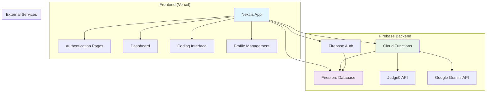

# Design Document

## Overview

CodeNest is architected as a modern full-stack web application using Next.js for the frontend and Firebase for the backend services. The platform follows a microservices approach with Firebase Cloud Functions handling external API integrations, while Firestore provides real-time data synchronization. The design emphasizes scalability, security, and user experience through adaptive content delivery and responsive design patterns.

## Architecture

### High-Level Architecture



### Technology Stack

- **Frontend**: Next.js 14+ with TypeScript, TailwindCSS, Framer Motion
- **Backend**: Firebase (Auth, Firestore, Cloud Functions)
- **Code Execution**: Judge0 API via Firebase Functions
- **AI Integration**: Google Gemini API via Firebase Functions
- **Deployment**: Vercel (Frontend), Firebase (Backend Functions)
- **Code Editor**: Monaco Editor with language support

## Components and Interfaces

### Frontend Components

#### Authentication System
```typescript
interface AuthProvider {
  signIn(email: string, password: string): Promise<User>
  signInWithGoogle(): Promise<User>
  signUp(email: string, password: string): Promise<User>
  signOut(): Promise<void>
  getCurrentUser(): User | null
}

interface User {
  uid: string
  email: string
  displayName?: string
  photoURL?: string
}
```

#### User Profile Management
```typescript
interface UserProfile {
  uid: string
  level: 'Beginner' | 'Intermediate' | 'Advanced'
  preferredLanguage: 'Python' | 'JavaScript' | 'Java' | 'C++' | 'C'
  theme: 'light' | 'dark'
  streak: number
  lastActiveDate: string
  totalXP: number
  solvedProblems: string[]
}

interface ProfileService {
  createProfile(uid: string, initialData: Partial<UserProfile>): Promise<void>
  updateProfile(uid: string, updates: Partial<UserProfile>): Promise<void>
  getProfile(uid: string): Promise<UserProfile>
  updateStreak(uid: string): Promise<number>
}
```

#### Coding Interface Components
```typescript
interface CodingProblem {
  id: string
  title: string
  description: string
  difficulty: 'Basic' | 'Intermediate' | 'Advanced'
  topic: string
  examples: Example[]
  constraints: string[]
  testCases: TestCase[]
  isAI: boolean
  createdAt: string
}

interface CodeEditor {
  language: string
  code: string
  onChange: (code: string) => void
  onRun: () => void
  onSubmit: () => void
}

interface TestResult {
  passed: boolean
  input: string
  expectedOutput: string
  actualOutput: string
  executionTime: number
  memoryUsage: number
  error?: string
}
```

### Backend Services

#### Firebase Cloud Functions
```typescript
// Function signatures for cloud functions
interface CloudFunctions {
  generateQuestion(data: {
    userLevel: string
    topic: string
    previousProblems: string[]
  }): Promise<CodingProblem>
  
  evaluateCode(data: {
    code: string
    language: string
    problemId: string
    testCases: TestCase[]
  }): Promise<EvaluationResult>
  
  updateStreak(data: {
    uid: string
    lastActiveDate: string
  }): Promise<{ streak: number, updated: boolean }>
}
```

#### Judge0 Integration
```typescript
interface Judge0Service {
  submitCode(submission: {
    source_code: string
    language_id: number
    stdin: string
    expected_output: string
  }): Promise<string> // submission token
  
  getResult(token: string): Promise<{
    status: { id: number, description: string }
    stdout: string
    stderr: string
    time: string
    memory: number
  }>
}
```

#### AI Question Generation
```typescript
interface OpenRouterService {
  generateProblem(prompt: {
    level: string
    topic: string
    context: string
  }): Promise<{
    title: string
    description: string
    examples: Example[]
    constraints: string[]
    solution: string
    testCases: TestCase[]
  }>
}
```

## Data Models

### Firestore Collections

#### Users Collection
```typescript
interface UserDocument {
  uid: string
  email: string
  displayName?: string
  level: 'Beginner' | 'Intermediate' | 'Advanced'
  preferredLanguage: string
  theme: 'light' | 'dark'
  streak: number
  lastActiveDate: Timestamp
  totalXP: number
  solvedProblems: string[]
  createdAt: Timestamp
  updatedAt: Timestamp
}
```

#### Questions Collection
```typescript
interface QuestionDocument {
  id: string
  title: string
  description: string
  difficulty: 'Basic' | 'Intermediate' | 'Advanced'
  topic: string
  examples: Example[]
  constraints: string[]
  testCases: TestCase[]
  isAI: boolean
  createdBy?: string // uid if AI generated
  createdAt: Timestamp
  tags: string[]
}

interface Example {
  input: string
  output: string
  explanation?: string
}

interface TestCase {
  input: string
  expectedOutput: string
  isHidden: boolean
}
```

#### Submissions Collection
```typescript
interface SubmissionDocument {
  id: string
  uid: string
  problemId: string
  code: string
  language: string
  status: 'Accepted' | 'Wrong Answer' | 'Time Limit Exceeded' | 'Runtime Error' | 'Compilation Error'
  executionTime?: number
  memoryUsage?: number
  testResults: TestResult[]
  submittedAt: Timestamp
}
```

#### Daily Challenges Collection
```typescript
interface DailyChallengeDocument {
  id: string
  date: string // YYYY-MM-DD format
  beginnerProblem: string // problem ID
  intermediateProblem: string
  advancedProblem: string
  createdAt: Timestamp
}
```

## Error Handling

### Frontend Error Handling
- **Authentication Errors**: Display user-friendly messages for login failures, network issues
- **Code Execution Errors**: Show compilation errors with line numbers and syntax highlighting
- **Network Errors**: Implement retry mechanisms with exponential backoff
- **Validation Errors**: Real-time form validation with clear error messages

### Backend Error Handling
- **Firebase Function Errors**: Structured error responses with error codes and messages
- **External API Failures**: Fallback mechanisms for Judge0 and Gemini API outages
- **Database Errors**: Transaction rollbacks and data consistency checks
- **Rate Limiting**: Implement request throttling to prevent abuse

### Error Response Format
```typescript
interface ErrorResponse {
  code: string
  message: string
  details?: any
  timestamp: string
}
```

## Testing Strategy

### Frontend Testing
- **Unit Tests**: Jest + React Testing Library for component testing
- **Integration Tests**: Test user flows like authentication, problem solving
- **E2E Tests**: Playwright for critical user journeys
- **Visual Regression**: Chromatic for UI component testing

### Backend Testing
- **Cloud Function Tests**: Firebase Functions testing framework
- **Database Tests**: Firestore emulator for data operations
- **API Integration Tests**: Mock external services (Judge0, Gemini)
- **Security Tests**: Firebase Security Rules testing

### Performance Testing
- **Load Testing**: Simulate concurrent users solving problems
- **Code Execution Performance**: Monitor Judge0 API response times
- **Database Performance**: Optimize Firestore queries and indexes

### Testing Data
```typescript
interface TestUser {
  uid: 'test-user-123'
  level: 'Intermediate'
  preferredLanguage: 'Python'
}

interface TestProblem {
  id: 'test-problem-1'
  title: 'Two Sum'
  difficulty: 'Basic'
  topic: 'Arrays'
}
```

## Security Considerations

### Authentication & Authorization
- Firebase Auth handles user authentication with secure token validation
- Firestore Security Rules enforce user-specific data access
- Cloud Functions validate user permissions before execution

### Data Protection
- Sensitive user data encrypted at rest in Firestore
- API keys stored in Firebase Functions environment variables
- HTTPS enforcement for all client-server communication

### Code Execution Security
- Judge0 API provides sandboxed code execution environment
- Input validation and sanitization for all user-submitted code
- Rate limiting on code execution to prevent abuse

## Deployment Architecture

### Vercel Frontend Deployment
- Next.js optimized build with static generation where possible
- Environment variables for Firebase configuration
- CDN distribution for global performance
- Preview deployments for feature branches

### Firebase Backend Deployment
- Cloud Functions deployed with proper IAM roles
- Firestore indexes optimized for query performance
- Security Rules deployed with functions
- Monitoring and logging enabled for all services