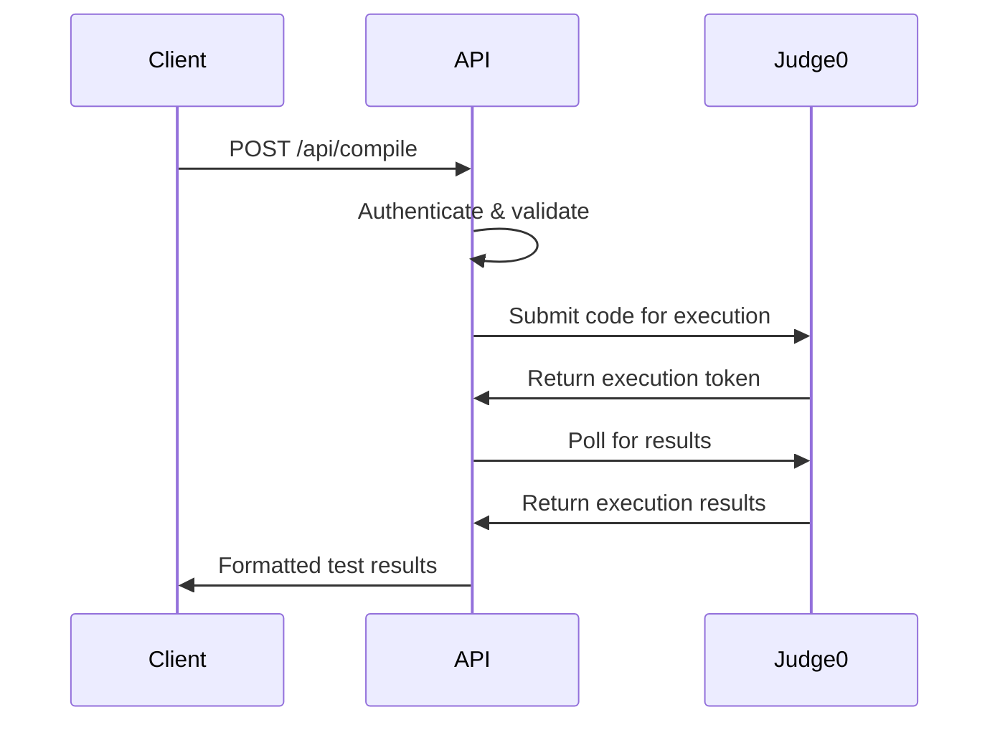
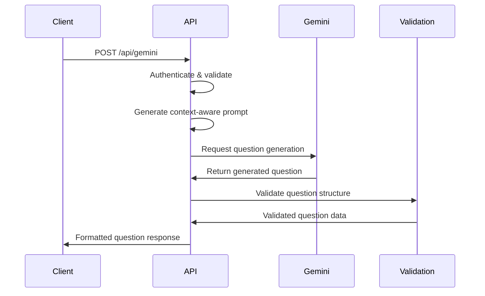
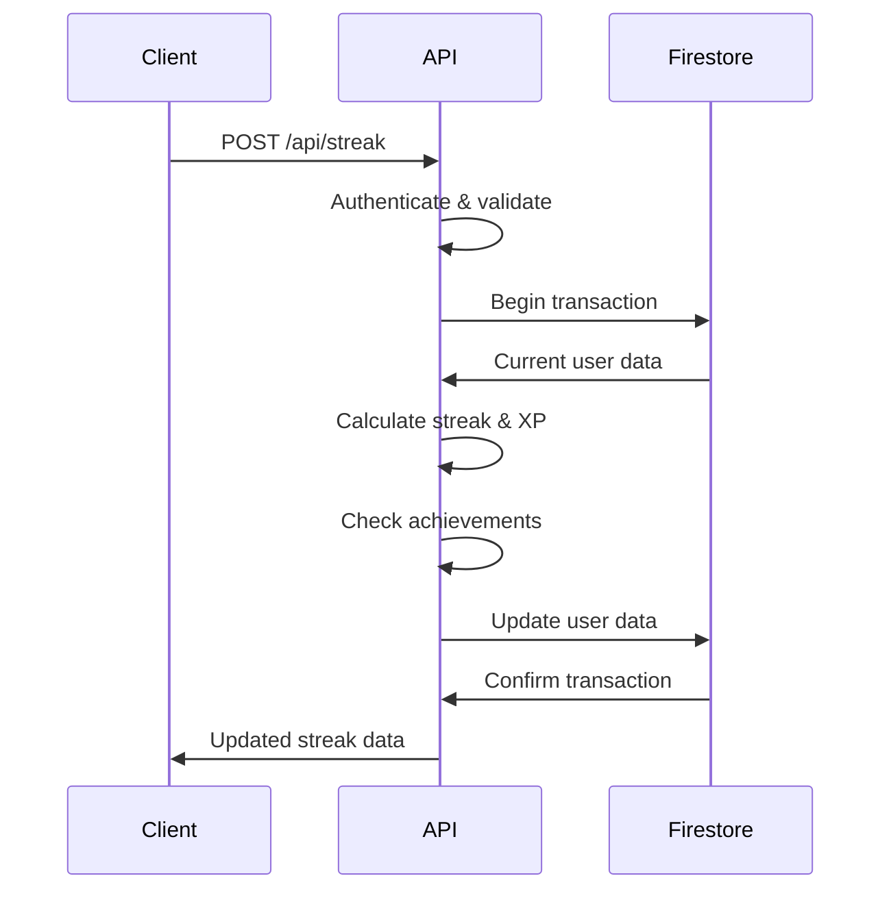

# API Architecture Documentation

## Overview

The CodeNest Platform API is built using Next.js App Router with a focus on security, scalability, and maintainability. This document provides a comprehensive overview of the API architecture, design patterns, and implementation details.

## Architecture Diagram

```mermaid
graph TB
    subgraph "Client Layer"
        A[React Frontend] --> B[Auth Context]
        B --> C[API Client]
    end
    
    subgraph "API Layer (Next.js App Router)"
        C --> D[/api/compile]
        C --> E[/api/gemini]
        C --> F[/api/streak]
        
        D --> G[Auth Middleware]
        E --> G
        F --> G
        
        G --> H[Rate Limiting]
        H --> I[Input Validation]
        I --> J[Request Sanitization]
    end
    
    subgraph "External Services"
        D --> K[Judge0 API]
        E --> L[Google Gemini AI]
    end
    
    subgraph "Firebase Backend"
        G --> M[Firebase Admin Auth]
        F --> N[Firestore Database]
        M --> N
    end
    
    subgraph "Security Layer"
        O[Security Headers] --> P[Error Handling]
        P --> Q[Response Formatting]
    end
    
    J --> O
    
    style A fill:#e1f5fe
    style D fill:#f3e5f5
    style E fill:#f3e5f5
    style F fill:#f3e5f5
    style M fill:#e8f5e8
    style N fill:#e8f5e8
```

## Directory Structure

```
src/app/api/
├── README.md              # API documentation
├── SECURITY.md           # Security documentation
├── ARCHITECTURE.md       # This file
├── compile/
│   ├── route.ts         # Code compilation endpoint
│   └── __tests__/
│       └── route.test.ts
├── gemini/
│   ├── route.ts         # AI question generation
│   └── __tests__/
│       └── route.test.ts
└── streak/
    ├── route.ts         # Streak management
    └── __tests__/
        └── route.test.ts
```

## Core Components

### 1. Authentication Middleware (`/lib/api-middleware.ts`)

#### Firebase Admin SDK Integration
```typescript
// Singleton pattern for Firebase Admin initialization
if (!getApps().length) {
  initializeApp({
    credential: cert({
      projectId: process.env.FIREBASE_PROJECT_ID,
      clientEmail: process.env.FIREBASE_CLIENT_EMAIL,
      privateKey: process.env.FIREBASE_PRIVATE_KEY?.replace(/\\n/g, '\n'),
    }),
  });
}
```

#### Authentication Flow
```typescript
export async function verifyAuth(request: NextRequest): Promise<{
  success: boolean;
  user?: DecodedIdToken;
  error?: string;
  status?: number;
}> {
  // Extract Bearer token from Authorization header
  // Verify token with Firebase Admin
  // Return user context or error
}
```

#### Higher-Order Authentication Wrapper
```typescript
export function withAuth<T extends any[]>(
  handler: (request: AuthenticatedRequest, ...args: T) => Promise<NextResponse>
) {
  return async (request: NextRequest, ...args: T): Promise<NextResponse> => {
    const authResult = await verifyAuth(request);
    if (!authResult.success) {
      return NextResponse.json({ error: authResult.error }, { status: authResult.status });
    }
    const authenticatedRequest = request as AuthenticatedRequest;
    authenticatedRequest.user = authResult.user!;
    return handler(authenticatedRequest, ...args);
  };
}
```

### 2. Request Validation System

#### Schema-Based Validation
```typescript
export function validateRequestBody<T>(
  body: any,
  requiredFields: (keyof T)[],
  optionalFields: (keyof T)[] = []
): { isValid: boolean; error?: string; data?: T } {
  // Validate required fields
  // Filter unknown fields
  // Return typed data
}
```

#### Input Sanitization
```typescript
export function sanitizeInput(input: any): any {
  if (typeof input === 'string') {
    return input
      .replace(/[<>]/g, '') // Remove HTML tags
      .trim()
      .slice(0, 10000); // Limit length
  }
  // Handle arrays and objects recursively
}
```

### 3. Rate Limiting System

#### In-Memory Rate Limiting
```typescript
const rateLimitStore = new Map<string, { count: number; resetTime: number }>();

export function rateLimit(
  maxRequests: number = 100,
  windowMs: number = 15 * 60 * 1000
) {
  return (request: NextRequest): { allowed: boolean; error?: string } => {
    // Track requests by IP address
    // Implement sliding window rate limiting
    // Clean up expired entries
  };
}
```

### 4. Security Headers & Response Formatting

#### Security Headers
```typescript
export function addSecurityHeaders(response: NextResponse): NextResponse {
  response.headers.set('X-Content-Type-Options', 'nosniff');
  response.headers.set('X-Frame-Options', 'DENY');
  response.headers.set('X-XSS-Protection', '1; mode=block');
  response.headers.set('Referrer-Policy', 'strict-origin-when-cross-origin');
  response.headers.set('Content-Security-Policy', "default-src 'self'");
  return response;
}
```

#### Consistent Response Format
```typescript
export function createSuccessResponse(data: any, message?: string): NextResponse {
  return addSecurityHeaders(NextResponse.json({
    success: true,
    data,
    ...(message && { message }),
    timestamp: new Date().toISOString(),
  }));
}

export function createErrorResponse(error: string, status: number = 500, details?: string): NextResponse {
  return addSecurityHeaders(NextResponse.json({
    error,
    ...(details && { details }),
    timestamp: new Date().toISOString(),
  }, { status }));
}
```

## API Endpoints

### 1. Code Compilation API (`/api/compile`)

#### Purpose
Execute user code against test cases using Judge0 API for secure sandboxed execution.

#### Architecture


#### Key Features
- **Language Support**: Python, Java, JavaScript, C++, C
- **Test Case Execution**: Both public and hidden test cases
- **Resource Management**: Execution time and memory tracking
- **Error Handling**: Compilation and runtime error reporting

#### Implementation Pattern
```typescript
export const POST = withAuth(async (request: AuthenticatedRequest): Promise<NextResponse> => {
  // Rate limiting (50 requests per 15 minutes)
  // Request validation and sanitization
  // Language and action validation
  // Judge0 API integration
  // Result processing and formatting
  // Response with security headers
});
```

### 2. AI Question Generation API (`/api/gemini`)

#### Purpose
Generate personalized coding questions using Google Gemini AI based on user skill level and topic preferences.

#### Architecture


#### Key Features
- **Adaptive Difficulty**: Questions tailored to user skill level
- **Topic Specialization**: Focused on specific programming concepts
- **Context Awareness**: Avoids previously solved problems
- **Quality Validation**: Ensures generated questions meet standards

#### Prompt Engineering
```typescript
function generatePrompt(userLevel: string, topic: string, previousProblems: string[] = []): string {
  const levelPrompts = TOPIC_PROMPTS[userLevel as keyof typeof TOPIC_PROMPTS] || {};
  const topicPrompt = levelPrompts[topic as keyof typeof levelPrompts];
  
  return `You are an expert coding interview question generator. ${topicPrompt}.
  
  Requirements:
  - Difficulty level: ${userLevel}
  - Topic focus: ${topic}
  - Return valid JSON with specific structure
  ${previousProblems.length > 0 ? `\nAvoid: ${previousProblems.join(', ')}` : ''}`;
}
```

### 3. Streak Management API (`/api/streak`)

#### Purpose
Manage user activity streaks, XP points, and achievements with atomic database operations.

#### Architecture


#### Key Features
- **Atomic Operations**: Firestore transactions ensure data consistency
- **Streak Calculation**: Daily activity tracking with break detection
- **XP System**: Points with streak multipliers and bonuses
- **Achievement System**: Milestone tracking and badge awards

#### Streak Logic
```typescript
function calculateStreakUpdate(lastActivityDate: string | null, currentStreak: number): {
  newStreak: number;
  streakBroken: boolean;
  streakContinued: boolean;
} {
  const today = new Date();
  const daysDifference = calculateDaysDifference(lastActivityDate, today);
  
  if (daysDifference === 0) return { newStreak: currentStreak, streakBroken: false, streakContinued: false };
  if (daysDifference === 1) return { newStreak: currentStreak + 1, streakBroken: false, streakContinued: true };
  return { newStreak: 1, streakBroken: true, streakContinued: false };
}
```

## Design Patterns

### 1. Middleware Pattern
All API routes use consistent middleware for authentication, rate limiting, and validation.

```typescript
// Pattern: Higher-order function wrapping
export const POST = withAuth(handleFunction);

// Pattern: Middleware composition
const processRequest = compose(
  verifyAuth,
  rateLimit,
  validateInput,
  sanitizeInput
);
```

### 2. Factory Pattern
Response creation uses factory functions for consistency.

```typescript
// Success response factory
const successResponse = createSuccessResponse(data, message);

// Error response factory
const errorResponse = createErrorResponse(error, status, details);
```

### 3. Strategy Pattern
Different validation strategies for different endpoint types.

```typescript
// Validation strategy selection
const validation = validateRequestBody<CompileRequest>(
  rawBody,
  ['code', 'language', 'testCases', 'action'] // Required fields strategy
);
```

## Performance Considerations

### 1. Caching Strategy
- **Rate Limit Store**: In-memory caching for rate limit counters
- **Firebase Admin**: Singleton pattern for SDK initialization
- **Response Caching**: Static responses cached at CDN level

### 2. Resource Management
- **Connection Pooling**: Firebase Admin SDK handles connection pooling
- **Memory Management**: Automatic cleanup of expired rate limit entries
- **Execution Limits**: Judge0 API provides resource-bounded execution

### 3. Scalability
- **Stateless Design**: All API endpoints are stateless
- **Horizontal Scaling**: Vercel functions scale automatically
- **Database Optimization**: Firestore indexes for efficient queries

## Error Handling Strategy

### 1. Error Classification
```typescript
// Authentication errors
if (error.message.includes('expired')) {
  return { success: false, error: 'Token has expired', status: 401 };
}

// Validation errors
if (!validation.isValid) {
  return createErrorResponse(validation.error!, 400);
}

// External service errors
if (error.message.includes('quota')) {
  return createErrorResponse('Service temporarily unavailable', 429);
}
```

### 2. Error Logging
```typescript
// Server-side logging (detailed)
console.error('API Error:', {
  endpoint: request.url,
  method: request.method,
  error: error.message,
  stack: error.stack,
  timestamp: new Date().toISOString()
});

// Client response (sanitized)
return createErrorResponse('Internal server error', 500);
```

## Testing Strategy

### 1. Unit Tests
Each API endpoint includes comprehensive unit tests covering:
- Authentication scenarios
- Input validation
- Error handling
- Success cases

### 2. Integration Tests
- External API integration (Judge0, Gemini)
- Firebase Admin SDK integration
- End-to-end request/response cycles

### 3. Security Tests
- Authentication bypass attempts
- Input injection testing
- Rate limit enforcement
- CORS policy validation

## Deployment Architecture

### 1. Vercel Configuration
```typescript
// next.config.ts
export default {
  api: {
    bodyParser: {
      sizeLimit: '1mb',
    },
    responseLimit: '8mb',
  },
  env: {
    // Environment variable configuration
  }
};
```

### 2. Environment Management
- **Development**: `.env.local` for local development
- **Staging**: Vercel environment variables for staging
- **Production**: Encrypted environment variables for production

### 3. Monitoring & Observability
- **Error Tracking**: Server-side error logging
- **Performance Monitoring**: API response time tracking
- **Usage Analytics**: Request pattern analysis

## Future Enhancements

### 1. Caching Layer
- **Redis Integration**: Replace in-memory rate limiting with Redis
- **Response Caching**: Cache AI-generated questions and compilation results
- **CDN Optimization**: Leverage Vercel Edge Network for static responses

### 2. Advanced Security
- **API Key Management**: Implement API key rotation system
- **Advanced Rate Limiting**: Per-user and per-endpoint rate limiting
- **Request Signing**: HMAC-based request authentication

### 3. Scalability Improvements
- **Database Optimization**: Implement read replicas for Firestore
- **Load Balancing**: Distribute load across multiple regions
- **Microservices**: Split API into specialized microservices

---

*Last Updated: January 28, 2025*
*Version: 1.0*