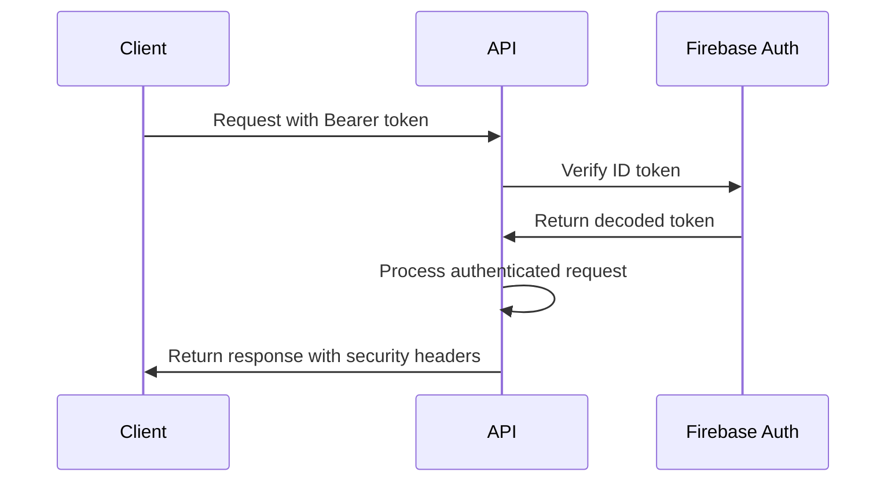

# API Security Documentation

## Overview

The CodeNest Platform API implements comprehensive security measures to protect user data and prevent abuse. This document outlines the security architecture, authentication flow, and best practices implemented across all API endpoints.

## Security Architecture

### 1. Authentication & Authorization

#### Firebase Admin SDK Integration
- **Server-side Authentication**: All API routes use Firebase Admin SDK for secure token verification
- **Token Validation**: ID tokens are verified using Firebase Auth's `verifyIdToken()` method
- **User Context**: Authenticated requests include decoded user information for authorization

#### Authentication Flow


#### Implementation Details
```typescript
// Authentication middleware usage
export const POST = withAuth(handleCompile);

// Manual authentication check
const authResult = await verifyAuth(request);
if (!authResult.success) {
  return createErrorResponse(authResult.error!, authResult.status!);
}
```

### 2. Rate Limiting

#### Configuration
- **Default Limit**: 100 requests per 15-minute window per IP
- **Compile Endpoint**: 50 requests per 15-minute window (resource intensive)
- **Storage**: In-memory store (production should use Redis)

#### Implementation
```typescript
const rateLimitCheck = rateLimit(50, 15 * 60 * 1000)(request);
if (!rateLimitCheck.allowed) {
  return createErrorResponse(rateLimitCheck.error!, 429);
}
```

### 3. Input Validation & Sanitization

#### Request Validation
- **Schema Validation**: All request bodies validated against predefined schemas
- **Required Fields**: Enforced at API level with clear error messages
- **Type Safety**: TypeScript interfaces ensure type correctness

#### Input Sanitization
- **XSS Prevention**: HTML tags stripped from string inputs
- **Length Limits**: Input strings limited to 10,000 characters
- **Recursive Sanitization**: Objects and arrays sanitized recursively

```typescript
const validation = validateRequestBody<CompileRequest>(
  rawBody,
  ['code', 'language', 'testCases', 'action']
);

const sanitizedData = sanitizeInput(validation.data!);
```

### 4. Security Headers

All API responses include comprehensive security headers:

```typescript
response.headers.set('X-Content-Type-Options', 'nosniff');
response.headers.set('X-Frame-Options', 'DENY');
response.headers.set('X-XSS-Protection', '1; mode=block');
response.headers.set('Referrer-Policy', 'strict-origin-when-cross-origin');
response.headers.set('Content-Security-Policy', "default-src 'self'");
```

### 5. Error Handling

#### Secure Error Responses
- **No Information Leakage**: Sensitive details not exposed in error messages
- **Consistent Format**: Standardized error response structure
- **Logging**: Detailed errors logged server-side for debugging

```typescript
// Safe error response
return createErrorResponse(
  'Authentication failed', // Generic message
  401,
  // Detailed error only logged, not returned
);
```

## API Endpoint Security

### 1. `/api/compile` - Code Execution Security

#### Sandboxing
- **Judge0 Integration**: Code executed in isolated sandbox environment
- **Resource Limits**: Execution time and memory limits enforced
- **Language Restrictions**: Only whitelisted languages supported

#### Security Measures
```typescript
// Language validation
if (!(language in LANGUAGE_MAP)) {
  return createErrorResponse(
    `Unsupported language: ${language}`,
    400
  );
}

// Rate limiting for resource-intensive operations
const rateLimitCheck = rateLimit(50, 15 * 60 * 1000)(request);
```

### 2. `/api/generateQuestion` - AI Service Security

#### API Key Protection
- **Environment Variables**: OpenRouter API key stored securely
- **Request Validation**: User level and topic validated before AI calls
- **Response Sanitization**: AI responses validated and sanitized

#### Security Measures
```typescript
// Validate user level
if (!['Beginner', 'Intermediate', 'Advanced'].includes(userLevel)) {
  return createErrorResponse('Invalid userLevel', 400);
}

// Validate AI response structure
if (!validateGeneratedQuestion(generatedQuestion)) {
  return createErrorResponse('Invalid question structure generated', 500);
}
```

### 3. `/api/streak` - Data Integrity Security

#### Transaction Safety
- **Firestore Transactions**: Ensure data consistency during updates
- **Atomic Operations**: Streak calculations performed atomically
- **Data Validation**: User data validated before database operations

#### Security Measures
```typescript
// Firestore transaction for data consistency
const result = await db.runTransaction(async (transaction) => {
  const userDoc = await transaction.get(userRef);
  // ... perform calculations
  transaction.set(userRef, updatedData, { merge: true });
  return updatedData;
});
```

## Environment Security

### Required Environment Variables

```env
# Firebase Admin SDK (Server-side)
FIREBASE_PROJECT_ID=your-project-id
FIREBASE_CLIENT_EMAIL=your-service-account-email
FIREBASE_PRIVATE_KEY=your-private-key

# External API Keys
JUDGE0_API_KEY=your-rapidapi-key
JUDGE0_API_URL=https://judge0-ce.p.rapidapi.com
JUDGE0_API_HOST=judge0-ce.p.rapidapi.com
OPENROUTER_API_KEY=your-openrouter-api-key

# Client-side Firebase Config
NEXT_PUBLIC_FIREBASE_API_KEY=your-api-key
NEXT_PUBLIC_FIREBASE_AUTH_DOMAIN=your-project.firebaseapp.com
NEXT_PUBLIC_FIREBASE_PROJECT_ID=your-project-id
NEXT_PUBLIC_FIREBASE_STORAGE_BUCKET=your-project.appspot.com
NEXT_PUBLIC_FIREBASE_MESSAGING_SENDER_ID=123456789
NEXT_PUBLIC_FIREBASE_APP_ID=1:123456789:web:abcdef123456
```

### Security Best Practices

1. **Environment Variable Management**
   - Use `.env.local` for development
   - Configure Vercel environment variables for production
   - Never commit sensitive keys to version control

2. **API Key Rotation**
   - Regularly rotate external API keys
   - Monitor API usage for anomalies
   - Implement key expiration policies

3. **Firebase Security Rules**
   - Implement strict Firestore security rules
   - Validate user permissions at database level
   - Use Firebase Auth for client-side authentication

## Vercel Deployment Security

### Production Configuration

1. **Environment Variables**
   - Set all required environment variables in Vercel dashboard
   - Use different keys for staging and production
   - Enable environment variable encryption

2. **Domain Security**
   - Configure CORS for production domains only
   - Use HTTPS enforcement
   - Implement proper CSP headers

3. **Function Limits**
   - **Execution Time**: 10 seconds (Hobby), 60 seconds (Pro)
   - **Memory**: 1024MB maximum
   - **API Routes**: Keep under 12 for Free Plan (currently using 3)

### Monitoring & Logging

1. **Error Tracking**
   - Server-side error logging implemented
   - Client-side error boundaries for UI
   - Performance monitoring for API endpoints

2. **Security Monitoring**
   - Rate limit violation tracking
   - Authentication failure monitoring
   - Unusual API usage pattern detection

## Security Testing

### Automated Tests

Each API endpoint includes security-focused tests:

```bash
# Run security tests
npm test -- --testPathPattern=api
npm test -- --testNamePattern="security|auth|validation"
```

### Test Coverage

1. **Authentication Tests**
   - Valid token acceptance
   - Invalid token rejection
   - Missing token handling

2. **Input Validation Tests**
   - Malformed request bodies
   - Missing required fields
   - XSS attempt prevention

3. **Rate Limiting Tests**
   - Normal usage patterns
   - Rate limit enforcement
   - Rate limit reset behavior

## Incident Response

### Security Incident Handling

1. **Detection**
   - Monitor error logs for security-related failures
   - Track unusual API usage patterns
   - Set up alerts for authentication failures

2. **Response**
   - Immediately rotate compromised API keys
   - Review and update security rules
   - Analyze attack vectors and implement fixes

3. **Recovery**
   - Restore service with enhanced security
   - Document lessons learned
   - Update security procedures

## Compliance & Standards

### Security Standards

- **OWASP Top 10**: Protection against common web vulnerabilities
- **Firebase Security**: Following Firebase security best practices
- **API Security**: RESTful API security guidelines
- **Data Protection**: User data encryption and privacy protection

### Regular Security Reviews

1. **Monthly Reviews**
   - API usage pattern analysis
   - Security log review
   - Environment variable audit

2. **Quarterly Updates**
   - Dependency security updates
   - Security rule reviews
   - Penetration testing (if applicable)

## Contact & Support

For security-related questions or to report vulnerabilities:

- **Development Team**: Internal security review process
- **Firebase Support**: For authentication and database security
- **Vercel Support**: For deployment and infrastructure security

---

*Last Updated: January 28, 2025*
*Version: 1.0*